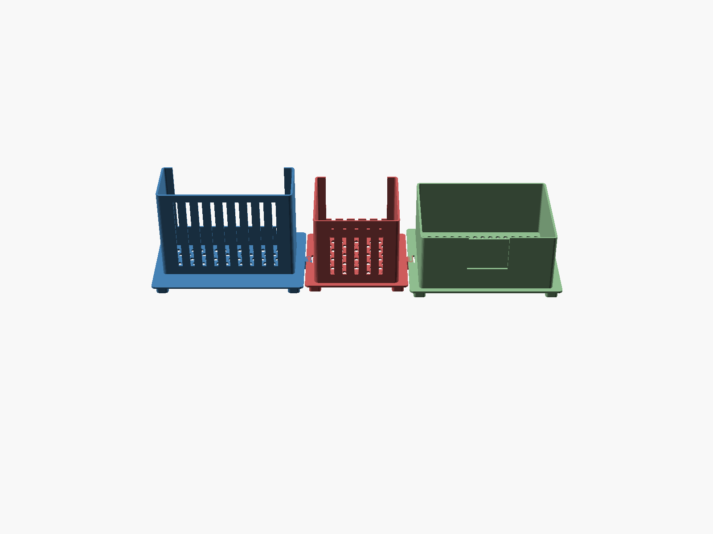

# Router Floor Caddy — Xfinity XB8 + Netgear Orbi RBR850

A well-ventilated, floor-standing caddy that holds two hot-running networking
towers upright, with a bin for incoming-cable entry ("cabinet input") and
storage of power bricks / cable slack. Open-stand design for maximum airflow.



It is a **modular set of three tiles** that **dovetail together** — no hardware.
A single tray holding both towers side-by-side plus storage would be ~590 mm
wide, far past a 256 mm print bed, so each tile prints on its own and slides
together on the floor:

```
[ Orbi cradle ] == [ XB8 cradle ] == [ cable-input + storage tray ]
   blue               red                green
```

## The two devices (measured / datasheet)

| Device | Footprint (W × D) | Height | Shape |
|---|---|---|---|
| Xfinity **XB8** gateway | ~117 × 117 mm | ~218 mm | square rounded-base tower |
| Netgear **Orbi RBR850** | ~190 × 72 mm | ~280 mm | tall leaf/egg tower |

Sources: the [HIDEit XB8 mount](https://hideitmounts.com/products/hideit-xb8-xfinity-xb8-gateway-modem-mount)
cradle is 120 mm square (confirming the ~117 mm XB8 base); Orbi dimensions are
from the Netgear RBK850 datasheet (11.02 × 7.50 × 2.81 in). Both are modeled as
rectangular pockets sized to the device footprint + 2 mm clearance per side; the
Orbi's curved leaf sits loosely in its rectangular pocket (add a strip of foam if
you want a snug grip).

No floor-caddy STL for these exists online — every hit is a *wall* mount, e.g.
[XB8 wall mount](https://www.printables.com/model/414508-xfinity-gateway-xb8-wall-mount),
[Orbi RBR850 mount](https://www.printables.com/model/48893-orbi-mount-for-rbr850-router-and-satellite) —
so this is modeled from dimensions, not remixed.

## Tiles

| Part | STL | Plate footprint | Wall height | Notes |
|---|---|---|---|---|
| Orbi cradle | `export/orbi-cradle.stl` | 228 × 150 mm (+10 tongue) | 140 mm | wide-shallow pocket; tongue on right |
| XB8 cradle | `export/xb8-cradle.stl` | 155 × 143 mm (+10 tongue) | 110 mm | square pocket; groove left, tongue right |
| Storage tray | `export/storage-tray.stl` | 228 × 172 mm | 90 mm | bin; back cable-notch + divider; groove left |

Each cradle grips only the lower ~50 % of its tower; the towers protrude above
the open top, fully exposed for cooling. The **front wall is lowered to 35 mm**
on the cradles for cable/port access and to relieve heat.

## Ventilation

- Hex-staggered perforated **floor** on every tile.
- **12 mm raised feet** → an open air gap under the whole caddy so air can enter
  from below and rise through the floor holes.
- Vertical **slot vents** in the cradle front/back walls.
- **Open tops**; towers stand exposed above the cradle line.

## Cable input + storage

The green tray has a **U-notch in the back wall** (incoming coax/ethernet from
the wall — the "cabinet input") and a fixed divider that fences a rear cable
channel off from the main bay (power bricks, splitters, cable slack).

## Printing

- **Material: PETG** recommended — it sits on a floor next to two warm devices;
  PETG tolerates heat far better than PLA. PLA works if the room stays cool.
- 0.2 mm layers, 15–20 % infill, 3 walls.
- **No supports needed** — all overhangs are vertical walls; floor holes (8 mm)
  and the cable notch bridge fine; dovetails print flat.
- Print orientation as exported (plate flat on the bed, feet down).
- Each tile fits a 256 mm bed (largest: Orbi cradle, 238 mm in X).

## Assembly

Stand the three tiles on the floor in the order Orbi · XB8 · Tray. Align an
edge tongue with its neighbor's groove and **slide the tiles together along the
front-to-back (Y) axis** until the dovetails seat. If a joint is loose/tight,
adjust `dt_clear` in `src/caddy.scad` and re-export. (M3 bolt holes can be added
later for a permanent lock — see "Out of scope" in the source header.)

## Build

```sh
just build      # export the three tile STLs to export/
just preview    # re-render the PNGs in images/  (uses xvfb-run)
just clean      # remove generated STLs
```

`src/caddy.scad` is the parametric source of truth — every dimension above is a
named parameter at the top. Change a device gap, wall height, or vent spacing
there and re-run `just build`. Select a part with `-D 'part="xb8"|"orbi"|"tray"'`
(default `"assembly"` is a preview-only view of all three abutted).

## Versions

- **v1** — first printable design: 3-tile dovetail caddy, vented cradles for
  XB8 + Orbi RBR850, cable-input/storage tray.
