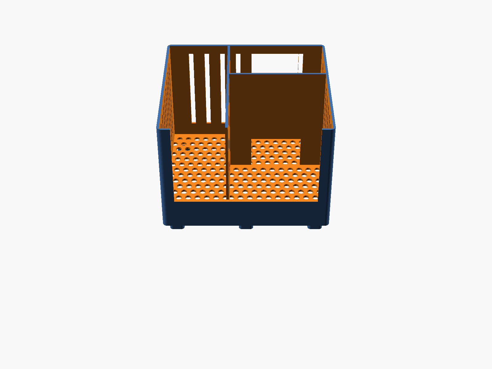
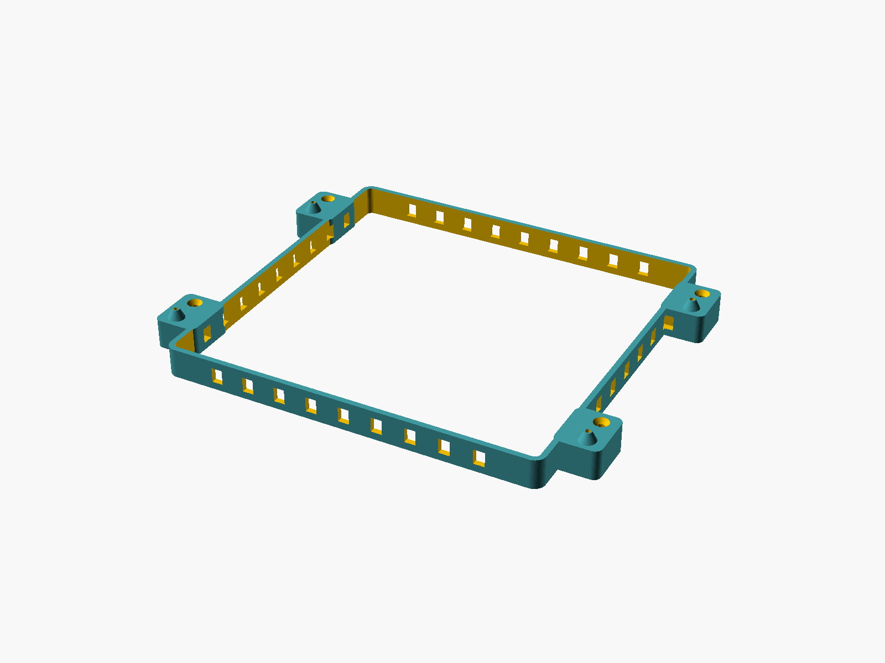
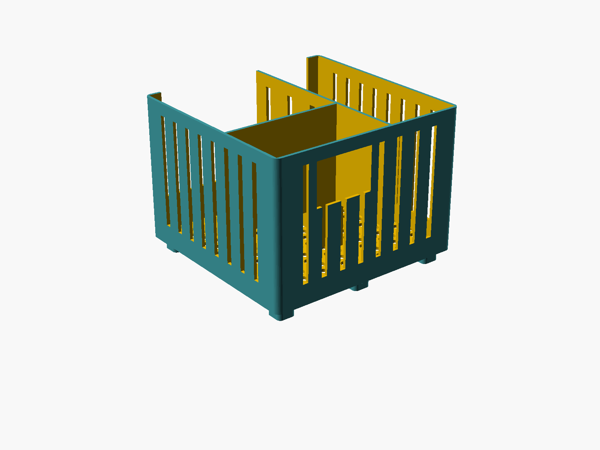

# Router Floor Caddy — Xfinity XB8 + Netgear Orbi RBR850

A well-ventilated, floor-standing caddy that holds two hot-running networking
towers upright, with a bay for incoming-cable entry ("cabinet input") and
storage (power bricks, cable slack). Honeycomb-vented walls, open tops.



## Two parts: body + floor-mount base

Prints as **two parts** (both fit a 256 mm bed):

- **`caddy-body.stl`** — the caddy shell with three internal bays (the box).
- **`caddy-base.stl`** — a low vented ring that screws to the floor; the body
  drops onto it and screws down separately, so the body is removable while the
  base stays floor-mounted.

**Installation:** screw the base to the floor through the 4 corner ears
(countersunk #8 holes). Set the body on the base — its 4 corner ears drop over
the base's **conical alignment posts** (the cones self-center the body). Drive an
M3 screw down through each body ear into the post (self-tapping pilot). To remove
the body later, back out the 4 M3 screws; the base stays put.


The whole joint is **support-free**: the cones self-support (sloped walls),
holes are vertical, and every countersink opens upward.

## The box

The body is a single shell with three internal bays, footprint **206 × 200 mm**
(246 mm across the mount ears), ~143 mm tall.

The trick that makes one piece possible: the two routers side-by-side would span
117 + 190 = 307 mm (over the bed), so the **Orbi is rotated 90°** — its thin
72 mm edge faces sideways instead of its 190 mm face. Both towers plus a storage
bay then pack into 206 × 200 mm. The storage/cable bay tucks into the depth gap
behind the shorter XB8:

```
 plan view (one shell, ~206 x 200 mm):
 +-----------+------------------+
 |           |   XB8 bay        |  front wall lowered (drop-in access)
 |  Orbi bay | ports v 117x117  |
 | (rotated) +---[pass]---------+   <- XB8 cables drop into storage
 | ports >   | storage + cable  |  back wall: cable-entry notch
 |  72 x 190 |   ^ Orbi cables  |
 +-----------+------------------+
   ports > = Orbi back face points at divider; cable passes into storage
```

## The two devices (measured / datasheet)

| Device | Footprint (W × D) | Height | Shape |
|---|---|---|---|
| Xfinity **XB8** gateway | ~117 × 117 mm | ~218 mm | square rounded-base tower |
| Netgear **Orbi RBR850** | ~190 × 72 mm | ~280 mm | tall leaf/egg tower |

Sources: the [HIDEit XB8 mount](https://hideitmounts.com/products/hideit-xb8-xfinity-xb8-gateway-modem-mount)
cradle is 120 mm square (confirming the ~117 mm XB8 base); Orbi dimensions are
from the Netgear RBK850 datasheet (11.02 × 7.50 × 2.81 in). Each bay is a
rectangular pocket sized to the device footprint + 2 mm clearance per side; the
Orbi's curved leaf sits loosely in its rectangular pocket (add a strip of foam if
you want a snug grip). No floor-caddy STL for these exists online — every hit is
a *wall* mount (e.g. [XB8](https://www.printables.com/model/414508-xfinity-gateway-xb8-wall-mount),
[Orbi](https://www.printables.com/model/48893-orbi-mount-for-rbr850-router-and-satellite)) —
so this is modeled from dimensions, not remixed.

Each bay grips only the lower ~half of its tower; the towers protrude above the
open tops, fully exposed for cooling. The **front wall is lowered to 35 mm** for
cable/port access and heat relief.

## Ventilation

- Hex-staggered perforated **floor** under every bay.
- **12 mm raised feet** → an open air gap under the whole caddy so air enters
  from below and rises through the floor holes and open tops.
- **Diagonal-lattice vents** (45° diamond openings) across the outer side/back
  walls AND both internal divider walls, so air (and cables) move freely between
  all three bays. Every opening peaks at 45°, so the walls have **no horizontal
  bridges at all** — the most support-free vent pattern.
- The **base ring** is slot-vented; air enters its sides, rises through the
  body's hex floor and out the open tops.
- **Open tops**; towers stand exposed above the shell line.

## Cable input + storage + router orientation

The central rear bay is the **cabling hub**. It has a **cable window in the back wall** (closed at the top by a rim bar so the wall sections beside it are tied together, not free-topped flaps)
for incoming coax/ethernet (the "cabinet input") and holds power bricks,
splitters, and cable slack.

**Both routers face their port (back) sides into this bay:**

- The **Orbi** is rotated so its port/broad face points at the **+X divider**;
  a low cable pass-through in that divider drops its cables into the storage bay.
- The **XB8** faces its ports at the **+Y divider** into the same bay through a
  matching low pass-through.

So every cable runs into the central bay and out the rear notch — nothing is
boxed against an outer wall. Directionality note: rotating the Orbi about its
vertical axis does **not** affect cooling (convection is bottom-to-top) or WiFi,
but it does move its port/vented broad face — hence the deliberate
divider-facing layout and the extra vents cut into the divider beside it.

## Printing

- **Material: PETG** recommended — it sits on a floor next to two warm devices;
  PETG tolerates heat far better than PLA. PLA works if the room stays cool.
- 0.2 mm layers, 15–20 % infill, 3 walls.
- **No supports needed** — walls are vertical; hexagons, hex floor holes, and the
  cable window all bridge fine; the base slots are tiny bridges.
- Print as exported: each part floor-down, open side up.
- Two prints (body + base), each ~246 × 200 mm — fit a 256 mm bed.
- **Hardware:** 4 × #8 wood/floor screws (base → floor) + 4 × M3 × ~12 mm
  self-tapping screws (body → base posts).

## Build

```sh
just build      # export caddy-body.stl + caddy-base.stl
just preview    # re-render the PNGs in images/  (uses xvfb-run)
just clean      # remove generated STLs
```

`src/caddy.scad` is the parametric source of truth — every dimension is a named
parameter at the top (device footprints, clearance, wall/shell height, storage
depth, vent sizing, and the base/ear/screw dimensions). `part="body"|"base"|
"assembly"` selects what to emit; change a parameter and re-run `just build`.

## Versions

- **v3.2** — wall + divider vents switched from honeycomb to a **45° diagonal
  lattice** (diamond openings). Every opening peaks at 45°, so there are no
  horizontal bridges — the most support-free vent pattern.
- **v3.1** — fully support-free: the body↔base joint uses **conical self-centering
  posts** (no blind sockets/overhangs); the cable window gets a center mullion so
  its rim is a short bridge; and **both internal divider walls are honeycombed**
  for cross-bay ventilation + cable passage.
- **v3** — split into **body + floor-mount base** (base screws to floor; body
  aligns on posts and screws down separately) and switched wall vents to a
  **honeycomb** lattice (angular, strong, print-friendly).
- **v2.7** — wall vents tuned to a diagonal lattice/trellis (thin 45° ribs,
  larger openings, fuller wall coverage). 
- **v2.6** — wall vents restyled from vertical slots to a diamond pattern
  (outer walls + dividers); floor stays hex, cable window keeps its clean border.
- **v2.5** — restored the back vent slots and shifted the cable window onto the
  slot grid so it keeps ~8 mm wall on each side (removed the thin sliver without
  deleting any slits). *(slots later replaced by diamonds in v2.6.)*
- **v2.4** — re-export at `$fn=64` (final smoothness).
- **v2.3** — kept back vent slots clear of the cable window (superseded by v2.5).
- **v2.2** — back cable cutout closed at the top with a rim bar (`back_rim`),
  so the wall sections flanking it are tied top and bottom instead of being
  free-topped flaps.
- **v2.1** — cabling fix: both routers' port faces aimed into the central
  storage bay via low divider pass-throughs; extra vents in the divider beside
  the Orbi's broad face. Same footprint, still one print.
- **v2** — single-piece unified box: one shell, three internal bays (Orbi
  rotated 90°, XB8, storage + cable notch), fits a 256 mm bed in one print.
- **v1** — three separate dovetail-together tiles (superseded; the assembled
  footprint was the same but it was three prints, not one).
